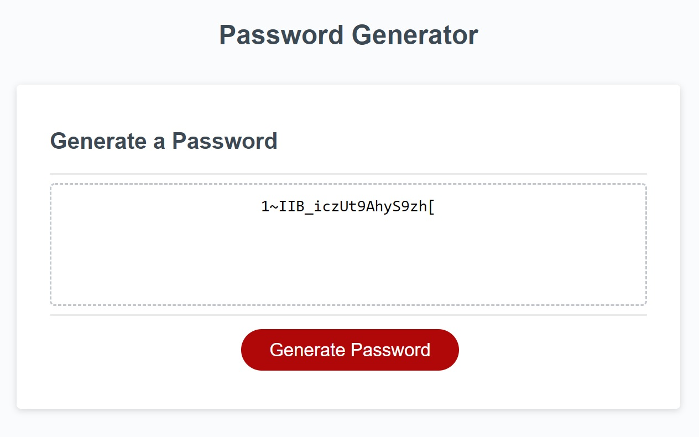

This Password Generator allows a user to generate a random password.

Once the user presses the "Generate Password" button, the user will receive five prompts.

The first prompt is for the password length, with a range from 8 to 128 characters.
If a number below 8 or above 128 is chosen, the prompt will return.

The next four prompts ask the user if lower case letters, upper case letters, number and symbols should be included.
For those four prompts, "ok" indicates include that type of caracter and "cancel" means do not include them.

The randomly-generated password will appear on the screen, using the selected character types.

The Password Generator is deployed at the following website: 
https://rebecca-diroll.github.io/03-Password-Generator/

Screenshot of the deployed website:
